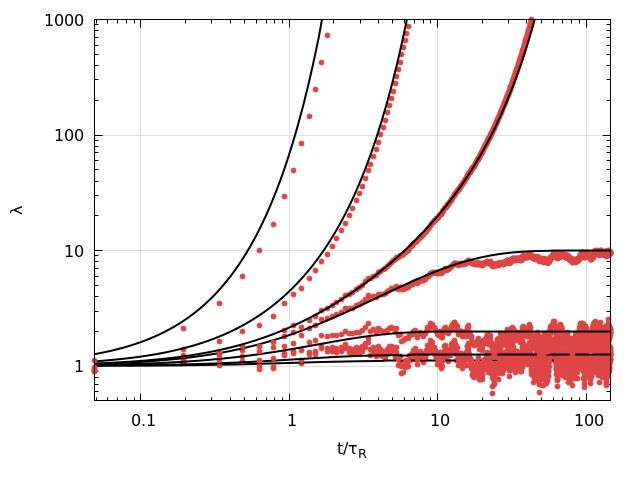

# MorusMD1D

*Molecular Dynamics* software for simulating the dynamics of *sticky polymers*.

The software is freely distributed under the GNU General Public License Version 3 (2007); see [LICENSE.txt](LICENSE.txt).

## Contents
1. About  
  1.1 Purpose  
  1.2 Model  
  1.3 Software Features  
2. Getting started   
  2.1 Prior to installation  
  2.2 Installation  
  2.3 Documentation  
4. Acknowlegdements

## 1. About

### 1.1. Purpose

While melts or semi-dilute solutions of polymers involve many interacting polymer chains, their linear- and non-linear viscoelastic rheology can often be quantitatively understood by modelling a single chain that undergoes curvilinear *Rouse diffusion* in an effective medium, i.e., in an "*entanglement tube"*.   
This software is specifically designed to simulate the 1D diffusion of polymers, and is in particular aimed at  
* **Development of new polymer-physics theory**: Temporary crosslinks impact contour-length fluctuations in the linear viscoelastic regime and chain extensional and retraction in the non-linear regime; new quantitative theories that describe these phenomena can be tested using these simulations.  
* **Reproducibility and transparancy**: This repository contains demos/tutorials to reproduce published results:   
  * Rubinstein & Colby - JCP 89, 5291 (1988), https://doi.org/10.1063/1.455620  
  * Leibler, Rubinstein and Colby, Macromolecules (1991)  (https://pubs.acs.org/doi/10.1021/ma0200219)  
  * Likhtman & McLeish, Macromolecules (2002)  (https://pubs.acs.org/doi/10.1021/ma0200219)  
  * Schaefer, Laity, Holland & McLeish, Macromolecules (2020)  (https://pubs.acs.org/doi/abs/10.1021/acs.macromol.9b02630)  
  * Schaefer & McLeish, PRL (2021) (https://journals.aps.org/prl/abstract/10.1103/PhysRevLett.126.057801)  
  * Schaefer, Laity, Holland & McLeish, Molecules (2021) (https://www.mdpi.com/1420-3049/26/6/1663)  

### 1.2 Model
The model is given in Schaefer et al., Molecules (2021) (https://www.mdpi.com/1420-3049/26/6/1663) and describes the extension and retraction of associating polymer chains with finite extensibility in flow.
Without finite extensibility, the model is equivalent to that given in Schaefer & McLeish in PRL 2021 (https://doi.org/10.3390/molecules26061663).
In the absence of flow, the model confirms the analytical predictions by Leibler, Rubinstein and Colby (https://pubs.acs.org/doi/abs/10.1021/ma00016a034) for the curvilinear diffusion coefficient of "sticky polymers" (matlab/octave scripts to calculate this diffusivity are included [here](utils/StickyDiffusionCoefficient.m).
In the absence of both flow and associations, the model is in exact agreement with the Langevin equation in Likhtman-McLeish 2002 (https://pubs.acs.org/doi/10.1021/ma0200219).

  

**Figure - Linear Dynamics**:  Consistency between simulations and theory predictions of the dynamics of a polymer with *Z*e=10 entanglements. (see demos for [mu(t) calculation](data/demo_calculate_mu.sh), [varying number of beads in mu(t) calculations](data/demo_LikhtmanMcLeishZe10.sh),  and [sticky reptation](data/demo_StickyDiffusivity.sh) ). *Left:* Reptation dynamics; for an increasing number of beads extrapolates to Likhtman-McLeish theory. *Right*: Influence of stickers on the diffusion coefficient. The number of stickers, *Z*s, and fraction of open stickers is varied (by implicitly changing the sticker association rate) at a fixed sticker lifetime *tau*s=104*tau*e. The approximation by Sticky Reptation theory is calculated using [this script](utils/StickyDiffusionCoefficient.m).

 

**Figure - Non-Linear Dynamics**: (see [demo](data/demo_extensional_flow.sh)) *Left*: Comparison of steady state chain length between simulation and analytical result at Wi=0.7. *Right*: Comparison of transient stretching between simulation and single-mode DEMG theory.

### 1.3 Software Features  

**Simulations** (C code)  
* Chain with *Z*e entanglements, *N* beads, arbitrary sequence of regular and sticky monomers.  
* Sticky monomers are modelled using a mean fraction of open stickers and using a sticker life time.  
* Extensional flow (tube is assumed to be aligned in the flow direction).  
* Three different implementations of the boundary condition.  
* Uniform thermal noise (Gaussian noise will potentially be implemented).  
* Two methods to calculate *mu*(t) function for tube relaxation by reptation.

**Utilities** (shell *.sh* + octave/matlab *.m* scripts)   
* Sticky-Reptation model to describe [sticky diffusivity](utils/StickyDiffusionCoefficient.m) and the the linear rheology [sticky-reptation model](utils/Octave/StickyReptation.m). An application is implemented in , which fits this model to rheological data to extract information on the number of entanglements and stickers, as well as the sticker lifetime.
* [Likhtman-McLeish](utils/Octave/LikhtmanMcLeish) calculation of *G*(*t*), *mu*(*t*) and constraint release.
* [Scripts](utils/Octave/getDynamicModuli) to transform *G*(*t*) to *G*'(*w*), *G*''(*w*).

**Figure**: Reproduction of Fig 6 in Likhtman-McLeish using the scripts in [utils](utils/Octave/LikhtmanMcLeish). *mu*(*t*) and *R*(*t*) give the contributions to chain relaxation by reptation and constraint release, respectively; *dmu*(*t*) and *dR*(*t*) are scaled derivatives.

## 2. Getting started

### 2.1.  Prior to installation

The simulation is written in C and has to be compiled using a gcc compiler.
Demos are written in UNIX shell script.
For plotting, [gnuplot](http://www.gnuplot.info/) (*.plt* scripts) is used (open source, free to use), which is installed as  
``sudo apt-get install gnuplot``.  
Postprocessing is done using *.m* scripts that can be run using matlab *or* [octave](https://www.gnu.org/software/octave) (open source, free to use): 
``sudo apt-get install octave``
Some scripts may require the installation of additional packages. The instructions are given in the relevant *.m* scripts.

### 2.2.  Installation 

The C code has no external dependencies other than standard libraries and can be compiled using cmake or gcc.    
**Method 1 (cmake):**  
``mkdir build``  
``cd build``  
``cmake ..``  
``make``  
**Method 2 (just gcc, no cmake):**  
``mkdir build``  
``cd build``  
``cp ../src/compile.sh .``  
``./compile.sh``

### 2.3.  Documentation 

The online [Manual](doc/Manual.md) discusses the usage of the program using some [demos](data).

## Acknowledgement 

 is thanked for sharing **Alexei Likhtman**'s original Brownian dynamics code, which was used to benchmark part of this code.   **Richard Graham** is thanked for sharing his code to solve the GLaMM model, which was also used to benchmark (a different) part of this code. **Tom McLeish**, **Pete Laity** and **Chris Holland** are thanked for discussions. The development of the software took place at the University of York, UK, and was funded by the EPSRC under grant number EP/N031431/1. 

  
