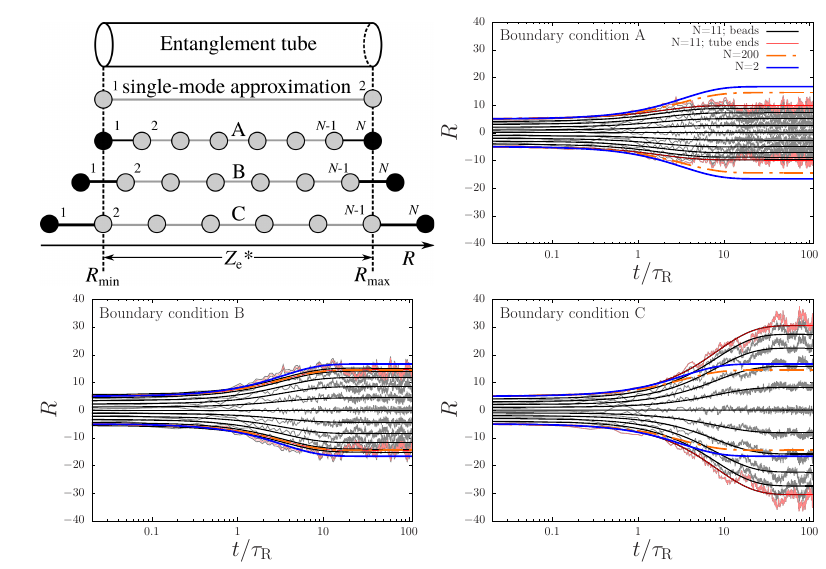

## Manual

## Contents


1. Introduction  
2. General Approach  
  2.1. Defining a Chain  
  2.2. Sticker Chemistry  
  2.3. Simulation Time  
  2.4. Boundary Condition  
  2.5. Simulation Output  
  2.6. Postprocessing
3. Demos/Tutorial  
  3.1. Rouse Diffusion in a Tube  
  3.2. Extentional flow  
  3.3. Reptation  
  3.4. Sticky Reptation  
  3.5. Sticky Dumbbell


## 1. Introduction

This manual is focussed on discussing the program features; the underlying physics is discussed in the user_manual.pdf.
The features are discussed using the demos in the [data](https://github.com/CharleySchaefer/Langevin/new/master/data) directory, which can be separated into two categories:  
* Simple (computationally inexpensive) scripts to focus on specific features of the program and exemplify how artifacts may emerge due to discretising the Langevin equation. The obvious control parameter is the number of beads in the simulation.  A more subtle one is the type of boundary condition, which is especially important in extensional flow.  
* Advanced (computationally more expensive) scripts that demonstrate how parameters may be varied, and how plots in the literature results may be reproduced.  
In the following, the features of the program are discussed with this buildup of "simple" to "advanced" in mind.

## 2. General approach

### 2.1. Defining a Chain

A chain is defined using the arguments ``--Ze`` and ``--sequence``. For instance,  
``./MorusMD --Ze 10 --sequence 01000100010``  
defines a chain with *Z*<sub>e</sub>=10 entanglements and *Z*<sub>s</sub>=3 stickers (see Sticker Chemistry section), modelled using 11 beads.

| argument | property |
| :--- | :---|
| ``--sequence``   | polymer sequence |
| ``--Ze``         | number of entanglements per chain |
| ``--Ne``         | number of monomers per entanglement strand |
| ``--kuhn-length``       | Kuhn length |
| ``--lambda-max``         | maximum chain extension |
| ``--exclude-fluctuations`` | Switch off Brownian fluctuations  |


### 2.2. Sticker Chemistry


The rates of sticker opening, *k*<sub>open</sub>, and closing, *k*<sub>close</sub>, are in principle fully controlled by the sticker lifetime, *tau*<sub>s</sub>=1/*k*<sub>open</sub>, and the ensemble-averaged fraction of open stickers, *p* (these parameters are the ones usually reported in the litature). Underlying to these properties are a bondswapping and a association-dissociation mechanism,
which have different concentration (\[*S*\]) dependences. This becomes important when \[*S*\] depends on the position in the tube (this variations are not yet implemented in the software, and \[*S*\] is set to unity).
The opening and closing rates in the program are given by  

  *k*<sub>open</sub> = *k*<sub>diss</sub> + *k*<sub>bondswap</sub>\[*S*\](1-*p*)  
  *k*<sub>close</sub> = *k*<sub>diss</sub>*p*/(1-*p*) + *k*<sub>bondswap</sub>\[*S*\](1-*p*)  

 Default, all parameters (except for \[*S*\]=1) are set to zero. The parameters can be set using  

 ``./MorusMD --sticker-kdiss <value> --sticker-kbondswap <value> --sticker-p <value>``


| argument | property |
| :--- | :--- |
| ``--sticker-sync``         | all stickers in same state |
| ``--sticker-p``         | fraction of closed stickers |
| ``--sticker-kbondswap``         | sticker bondswap rate |
| ``--sticker-kdiss``         | sticker dissociation rate |
| ``--sticker-kdiss-length``         | sticker dissociation length |
| ``--sticker-kdiss-Eact``         | sticker dissociation activation energy |

  

**Figure:** Schaefer et al. Molecules 2021, 26(6), 1663; https://doi.org/10.3390/molecules26061663 


### 2.3. Simulation Time  

The simulation time  can be defined using ``--Ntime <integer value>`` and the time step by  ``--time-fac <floating value>``. The value of the time step should be smaller than 0.5 to guarantee numerical stability.

| argument | property |  
| :--- | :--- |
| ``--Ntime``   | Number of time steps |
| ``--time-fac``   | Time discretisation |

### 2.4 Boundary Condition

The boundary condition can (optionally) be varied using ``--set-boundary <char>``, with the *char* being A, B or C; see the *extensional flow* example below. When this option is not entered, boundary '*B*' is used.


| argument | property |
| :--- | :---|
| ``--set-boundary``   | (``A``, ``B``, or ``C``) |

  

**Figure:** Various boundary-condition implementations.


### 2.5 Simulation Output

Output is genated after a fixed number of time steps defined by ``--Nprint <integer value>`` or after a variable number of time steps, evenly spaced on a logarithmic time axis, using ``--export-logt`` (this overrides ``--Nprint`` if both are used).
The program will write the input parameters to *param.in* and the simulation data to *timeprogress.out* to an output directory.
By default, the output directory is ``.``; it can be set to another directory using ``--outdir <output directory>``.


| argument | property |
| :--- | :---|
| ``--outdir``   | Output directory |
| ``--Nprint``   | Number of time steps after which data is exported |
| ``--export-log``   | Export evenly spaced on log time axis |


**timeprogress**  
Column    1: time in units of *tau*<sub>e</sub>  
Columns 2/3: spatial coordinates of endgroups, relative to the center of mass  
Column    4: Center of mass - in units of the tube diameter *a*.
Column    5: Stress, calculated as integral<sub>0</sub><sup>Z</sup>(d*R*/d*s*)^2 *ds*, with R in units of *a*.  
Remaining columns (optional, using ``--export-sequence``): spatial coordinates of individual beads.


### 2.5. Postprocessing

**Analysis using matlab/octave .m scripts**
Statistics are typically obtained using *.m* scripts, which can be run using matlab or the free alternative [octave](https://www.gnu.org/software/octave/index).
The script ```utils/run_mscript.sh``` checks which of these software packages is installed and uses that to run the *.m* scripts. 
Applications include  
* determination of the diffusion coefficient  
* averaging over multiple data sets

**Plotting**  
Plots are made using [gnuplot](http://www.gnuplot.info/) *.plt* scripts.


## 3. Demos/Tutorial

### 3.1. Rouse Diffusion in a Tube

The command

``./MorusMD --Ze 10 --sequence 00000 --Ntime 10000 --Nprint 100``

simulates a polymer chain of 10 entanglements using 5 beads for 10000 time steps.  The time simulated is 4x10<sup>5</sup> *tau*<sub>e</sub>, which is more than a 100 times the reptation time of the chain.
From the simulation output, exported to *timeprogress.out* every 100 steps, the diffusivity may be calculated.
This reproduces the theoretically known (dimensionless) value *D*=1/*pi*<sup>2</sup>*Z*<sub>e</sub>, with the length scale in units of the blob size *a* and time in units of *tau*<sub>e</sub>). This corresponds to *D*=*kT*/*zeta* *N*, with *kT* the thermal energy, *zeta* the monomeric friction and *N* the number of monomers (*physical* number of monomers **does not** equal the *numerical* number of beads).

To determine other properties, this small number of beads may not suffice. The next two example cases  discuss the influence of the number of beads per chain, as well as some considerations to take into account regarding the boundary conditions.


### 3.2. Extensional flow - influence of the number of beads and the boundary condition

The demo demo_extensional_flow.sh solves polymer stretching in extensional flow, 
with and without thermal fluctuations (turned off using  
``./MorusMD --exclude-fluctuations`` ),   
for three different types of boundary conditions *A*, *B* and *C*, selected using  
``./MorusMD --set-boundary <A, B or C>``  
The demo reveals Method *B* to be the most succesful. For this reason, method *B* is the default method used by the program.
The discrepancy of the other methods with the analytical result for polymer scretching can be remedied by increasing the number of beads.

### 3.3. Reptation - two methods to calculate mu(t) and the influence of the number of beads  

While the number of beads does not strongly affect the simulated value for the diffusion coefficient, 
it does affect the dynamics of contour length fluctuations, and hence the rate by which a polymer escapes the entanglement tube.
This is quantified by the function *mu*(*t*), which is the fraction of the tube that is not yet relaxed by reptation after time *t*.
Default, the program does not calculate *mu*(*t*) to save cpu time, 
but two methods to do this (with different accuracy and computational cost) can be activated as shown in the demo demo_calculate_mu.sh.
The simulated curve *mu*(*t*) is sensitive to the number of beads, and requires to perform simulations for a various number of beads and 
take the asymptotic limit of an infinite number of beads, see Likhtman-McLeish paper and the demo demo_LikhtmanMcLeishZe10.sh.


  

**Figure:** Schaefer & McLeish, PRL 2021 (https://journals.aps.org/prl/abstract/10.1103/PhysRevLett.126.057801).


### 3.4.  Sticky reptation

Having in mind the potential influence of the choice of the number of beads and the implementation method of the boundary condition,
a sticky polymer can be modelled by defining a sequence, e.g.,  
``./MorusMD --sequence 000100010010100010000``,  
where the ``1``s represent stickers, and the number of digits the number of beads. ,  
see demo_StickyDiffusivity.sh.
 

  

**Figure:** Schaefer & McLeish, PRL 2021 (https://journals.aps.org/prl/abstract/10.1103/PhysRevLett.126.057801).


### 3.5.  Sticky dumbbell

Sticky dumbbell model: stretching of a chain with synchronised stickers.
See demo_StickyDumbbell.sh


  

**Figure:** Schaefer & McLeish, PRL 2021 (https://journals.aps.org/prl/abstract/10.1103/PhysRevLett.126.057801).


